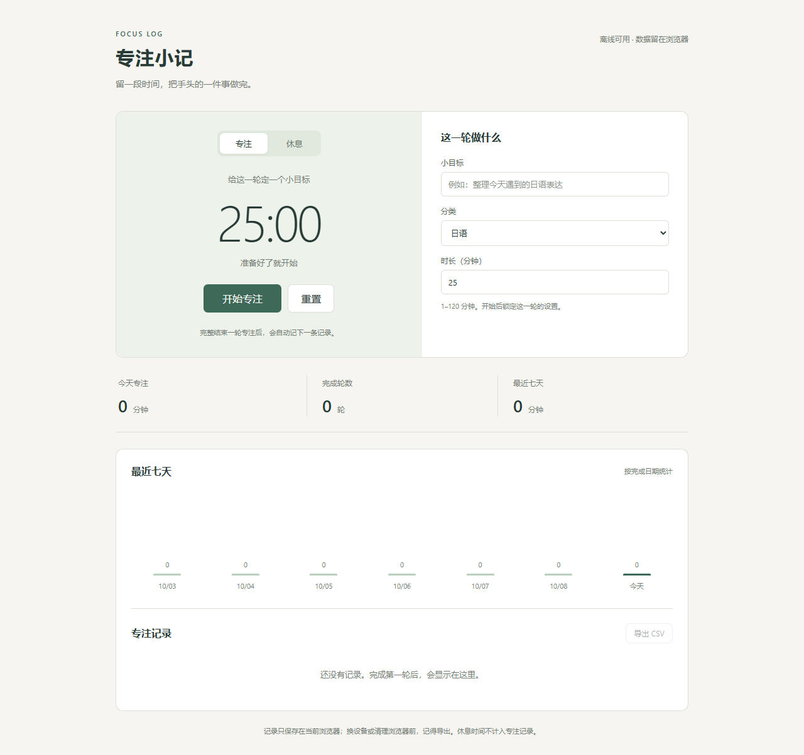

# Focus Log · 专注小记

一个简单的专注计时器。给日语、雅思、电路学习或练琴定一个小目标，完成后留下记录，再看看这一周的时间花在了哪里。

A small focus timer for language study, circuit work, coding, or piano practice. Set a task, finish a session, and keep a record of the time spent.



## 使用 / Use

下载仓库后，用浏览器打开 `index.html` 就能使用，不需要安装依赖。填写目标、分类和时长，点击“开始专注”。完整结束一轮后自动保存；重置未完成的一轮不会增加记录。休息模式默认 5 分钟，不计入专注统计。

Download the repository and open `index.html` in a browser. No dependencies are needed. Enter a task, choose a category and duration, then start. A completed focus session is saved automatically. Resetting an unfinished session adds no record. Break mode defaults to five minutes and does not count toward focus totals.

也可以从仓库目录启动本地服务，再打开 `http://localhost:8000`：

You can also serve the folder locally and visit `http://localhost:8000`:

```sh
python -m http.server 8000
```

## 当前功能 / Current features

- 1–120 分钟计时，暂停、继续和重置。 / A 1–120 minute timer with pause, resume, and reset.
- 刷新或重新打开页面后恢复计时，暂停状态也会保留。 / Restore an active or paused timer after refreshing or reopening the page.
- 记录目标、分类、开始时间、完成时间和专注分钟数。 / Task, category, start time, finish time, and focus minutes.
- 今日汇总与最近七天的简单柱状图。 / Today's totals and a simple chart for the last seven days.
- 导出 CSV，可用 Excel 或 WPS 打开。 / CSV export for Excel, WPS, or other spreadsheet tools.

CSV 列为 `task`、`category`、`started_at`、`finished_at`、`duration_minutes`。时间以 UTC 的 ISO 格式导出，页面按设备本地时间显示。带有公式前缀的任务名称会在导出时加上单引号，避免被表格软件当作公式执行。

The CSV columns are `task`, `category`, `started_at`, `finished_at`, and `duration_minutes`. Exported timestamps use ISO format in UTC; the page displays device-local time. Task names with formula prefixes are escaped with a leading apostrophe for spreadsheet safety.

## 几个限制 / Limitations

记录存在当前浏览器的 `localStorage` 中。清理浏览器数据会丢失记录，换浏览器、换设备或换访问地址也不会自动同步。关闭页面前可以导出 CSV；目前还不支持导入。

Records live in the current browser's `localStorage`. Clearing browser data removes them, and they are not synced across browsers, devices, or origins. Export a CSV before moving or clearing data. Import is not available yet.

开始、暂停和继续时会保存这一轮的状态。重新打开相同地址后，运行中的计时按原截止时间继续；暂停中的计时仍然暂停。如果关闭期间已到时间，回来后补记一条完成记录，完成日期按截止时间计算。

Starting, pausing, and resuming save the current session. Reopen the same address to continue a running timer against its saved deadline, or leave a paused timer paused. If the deadline passed while the page was closed, one completed session is recorded on return, dated at the deadline.

后台页面或设备休眠可能延迟结束提示。请只开一个计时页面；多个标签页同时操作暂时没有同步。浏览器禁止本地存储时，页面会提示进度无法保存。界面目前是中文，完成提醒只有页面文字，没有声音通知。

Background tabs or device sleep may delay the completion message. Use one timer tab; simultaneous tabs are not synced. If local storage is blocked, the page warns that progress cannot be saved. The interface is currently in Chinese, with a text-only completion message.

## 代码怎么分 / Code layout

`core.js` 放计时和 CSV 相关的计算，`app.js` 处理按钮、记录和图表，`style.css` 负责布局。计时保存一个截止时间，每次用当前时间计算剩余时长，避免把定时回调次数当成真实经过的时间。暂停时保存剩余时长，继续时重新计算截止时间。

`core.js` contains timer and CSV logic, `app.js` handles controls, storage, and the chart, and `style.css` defines the layout. The timer compares the current time with a deadline instead of counting interval callbacks. Pausing stores the remaining duration; resuming creates a new deadline.

恢复时读取保存的计时状态，不会重新开始一整轮。每轮有一个固定 ID，补记结束记录时先检查是否已有同一个 ID，避免刷新后重复计数。

Restoration reads the saved state instead of restarting a full session. Each session keeps a stable ID; completion checks that ID before adding a record, so reopening the page does not count the same session again.

装有 Node.js 时，可运行核心逻辑检查：

With Node.js installed, run the core checks:

```sh
node --test
```

想试着改代码，可以先在 `index.html` 里给分类加一项，比如“阅读”。然后完成一轮短计时，检查页面和导出的 CSV 是否都出现了新分类。

For a small first change, add a category such as “Reading” to `index.html`. Complete a short session and check that the new category appears both in the page and in the exported CSV.
